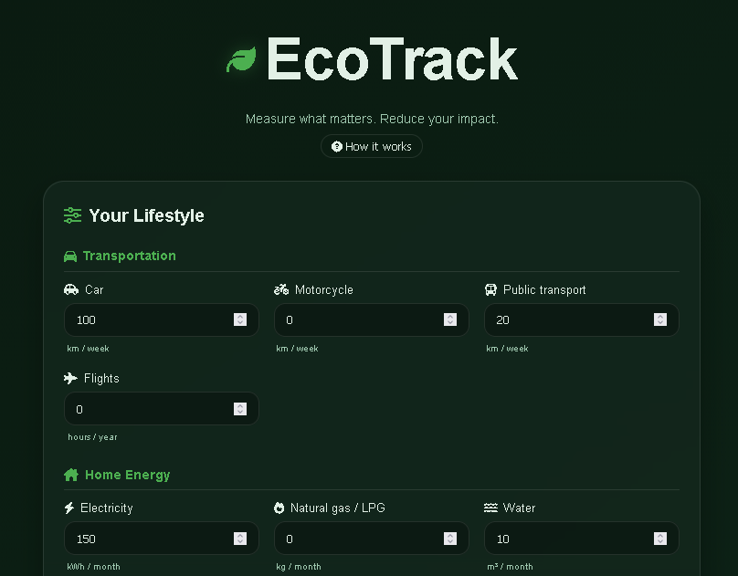
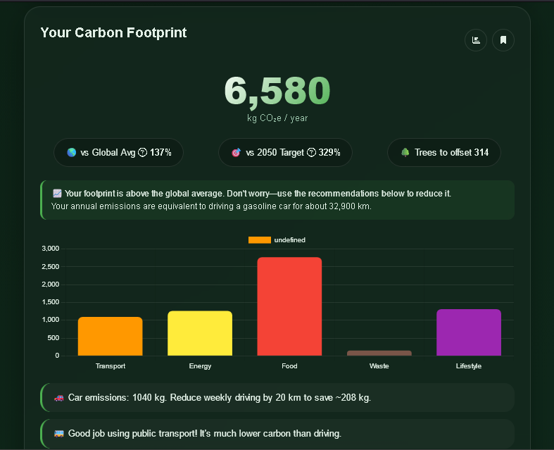
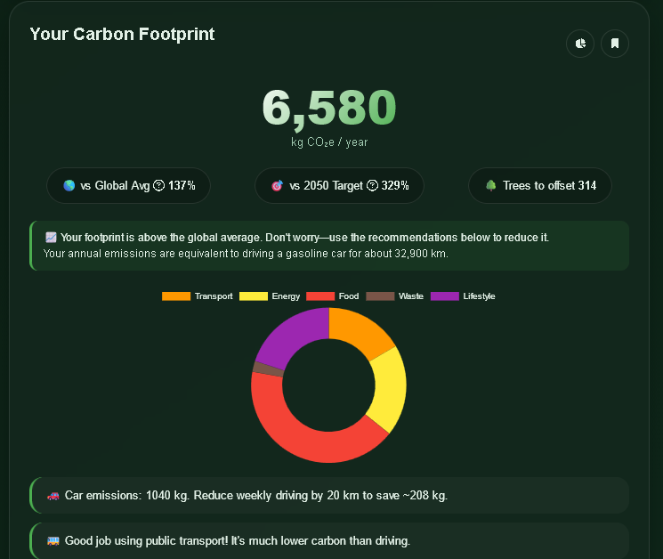

<!-- BADGES - Memberikan informasi sekilas dan profesional -->
<div align="center">


<br>


[](https://dev.to/setuju)

</div>

<br />
<div align="center">
  
  
  <h1>🌱 EcoTrack Pro</h1>

  <p align="center">
    <strong>Understand, track, and reduce your carbon footprint — one habit at a time.</strong>
    <br />
    A beautiful, full-featured carbon footprint dashboard built for the 
    <a href="https://dev.to/challenges/weekend-2026-04-16"><strong>DEV Weekend Challenge: Earth Day Edition</strong></a>.
    <br />
    <br />
    <a href="https://ecotrack-pro-theta.vercel.app/"><strong>✨ View Live Demo »</strong></a>
    ·
    <a href="https://github.com/setuju/ecotrack/issues">🐞 Report Bug</a>
    ·
    <a href="https://github.com/setuju/ecotrack/issues">💡 Request Feature</a>
  </p>
</div>

---

## 📸 **Preview**

<div align="center">

  <br><br>
  
  <br/><br>
  
  &nbsp;&nbsp;&nbsp;
  
</div>

---

## 🎯 **Why EcoTrack?**

Climate change is the defining challenge of our time, but individual action often feels disconnected from real impact. **EcoTrack** bridges that gap by turning complex carbon footprint data into a **personal, visual, and actionable dashboard**. 

This project is my submission for the **[DEV Weekend Challenge: Earth Day Edition](https://dev.to/challenges/weekend-2026-04-16)** , tackling the "Build for the Planet" prompt by empowering individuals to understand their impact and make informed, sustainable choices.

> **⚡ Pro Tip for Judges:** EcoTrack leverages **GitHub Copilot** throughout its development, accelerating the coding process and demonstrating a practical use of AI pair programming — a key category in this challenge. 

---

## ✨ **Key Features**

<table>
  <tr>
    <td width="50%">
      <h3>📊 Comprehensive Calculator</h3>
      <p>Track emissions across <strong>15+ lifestyle categories</strong>, from daily commutes and home energy to diet and shopping habits.</p>
    </td>
    <td width="50%">
      <h3>⚡ Real-Time Grid Data</h3>
      <p>Calculations adapt to your location using <strong>live carbon intensity data</strong> from Electricity Maps, making your footprint more accurate.</p>
    </td>
  </tr>
  <tr>
    <td width="50%">
      <h3>📈 Visual Insights & History</h3>
      <p>Understand your impact with <strong>interactive bar and pie charts</strong>. Toggle between views. Save and track your progress over time.</p>
    </td>
    <td width="50%">
      <h3>💡 Personalized Recommendations</h3>
      <p>Get <strong>tailored, actionable tips</strong> based on your exact inputs—not generic advice. Every suggestion includes estimated CO₂ savings.</p>
    </td>
  </tr>
  <tr>
    <td width="50%">
      <h3>☁️ Anonymous Cloud Sync</h3>
      <p>Your data is saved locally and optionally synced to Supabase using a <strong>device ID (no login required)</strong>. Complete privacy, full convenience.</p>
    </td>
    <td width="50%">
      <h3>📱 Share & Educate</h3>
      <p>Share your results on X, Facebook, LinkedIn, or copy a link. Built-in tooltips and a "How it Works" modal educate users about climate metrics.</p>
    </td>
  </tr>
</table>

---

## 🛠️ **Built With**

This project is a showcase of modern, vanilla web technologies—no heavy frameworks required.

*   **Frontend:** HTML5, CSS3 (Flexbox/Grid, Glassmorphism), JavaScript (ES6+)
*   **Visualization:** Chart.js for beautiful and interactive charts
*   **Backend & Storage:** Supabase (PostgreSQL) for anonymous cloud sync
*   **Data Sources:** 
    *   Emission factors: EPA, IPCC, Poore & Nemecek (2018) *Science*
    *   Grid intensity: Electricity Maps API (approximated)
*   **Icons & Fonts:** Font Awesome & Google Fonts (Inter)
*   **AI Assistance:** Developed with **GitHub Copilot** to accelerate feature implementation

---

## 🚀 **Getting Started (Run Locally)**

Getting a local copy up and running is incredibly easy—no `npm install`, no build steps.

### **Prerequisites**
*   A modern web browser (Chrome, Firefox, Safari, Edge)
*   (Optional) A [Supabase](https://supabase.com) account for cloud sync features

### **Installation**

1.  **Clone the repository:**
    ```bash
    git clone https://github.com/setuju/ecotrack.git
2. **Navigate to the project directory:**
    ```bash
    cd ecotrack
3. **Run with Python's built-in server (or any static server):**
   ```bash
    python3 server.py
    ```
    Alternatively, use `python3 -m http.server 8000` or the Live Server extension in VS Code.

4. **Open your browser and visit** `http://localhost:8000`.
   
### **Supabase Setup (Optional)**
To enable cloud sync, create a free Supabase project and run the following SQL in the SQL Editor:
```sql
-- Create the footprints table
CREATE TABLE footprints (
    id BIGINT PRIMARY KEY,
    device_id TEXT NOT NULL,
    total INTEGER NOT NULL,
    inputs JSONB NOT NULL,
    created_at TIMESTAMPTZ NOT NULL DEFAULT NOW()
);

-- Enable Row Level Security and allow anonymous insert/select
ALTER TABLE footprints ENABLE ROW LEVEL SECURITY;
CREATE POLICY "Enable insert for all" ON footprints FOR INSERT WITH CHECK (true);
CREATE POLICY "Enable select based on device_id" ON footprints FOR SELECT USING (device_id = current_setting('request.jwt.claims')::json->>'sub');
```
Then, update `config.js` with your Supabase URL and Anon Key.

---
## 📁 Project Structure

```text
ecotrack/
├── index.html          # Main application structure
├── style.css           # Styling (Glassmorphism, responsive, tooltips)
├── script.js           # Core logic, calculations, Supabase integration
├── config.js           # Environment configuration (Supabase keys)
├── server.py           # Simple Python development server
├── assets/             # Logo, screenshots, and favicon
├── LICENSE
└── README.md           # You are here!
```

---
## 🏆 Why This Project Deserves to Win
This submission aligns perfectly with the DEV Weekend Challenge's judging criteria:

1. 🎯 Relevance to Theme: Directly addresses "Build for the Planet" by creating a tool for personal climate action.
2. 💡 Creativity: Combines a beautiful, intuitive UI with a robust backend (Supabase) to offer a full-stack experience, all in vanilla JavaScript.
3. ⚙️ Technical Execution: Implements a complex calculator, interactive charts, anonymous cloud sync, and share functionality in a clean, maintainable codebase.
4. ✍️ Writing Quality: Both this README and the in-app text are written to be clear, engaging, and actionable.
5. 🛠️ Use of Prize Technology: Actively used GitHub Copilot to write functions, generate boilerplate, and debug, significantly speeding up development.

---

## 🤝 Contributing

Contributions are what make the open-source community such an amazing place to learn, inspire, and create. Any contributions you make are greatly appreciated.

1. Fork the Project
2. Create your Feature Branch (`git checkout -b feature/AmazingFeature`)
3. Commit your Changes (`git commit -m 'Add some AmazingFeature'`)
4. Push to the Branch (`git push origin feature/AmazingFeature`)
5.  Open a Pull Request

---
## 📜 License

Distributed under the MIT License. See `LICENSE` for more information.
---
## 📧 Contact & Social
Setuju – [@setuju](https://github.com/setuju/)

Project Link: [EcoTRACK](https://github.com/setuju/ecotrack)

DEV Community Post: [Read the story behind EcoTrack](https://dev.to/ggle_in)


**Live Demo:** [ecotrack-pro.netlify.app](https://ecotrack-pro.netlify.app/)
---

<div align="center">

🌍 Every calculation is a step toward a greener planet. Thank you for visiting!
If you find this project useful, please consider giving it a ⭐ on GitHub!
</div>